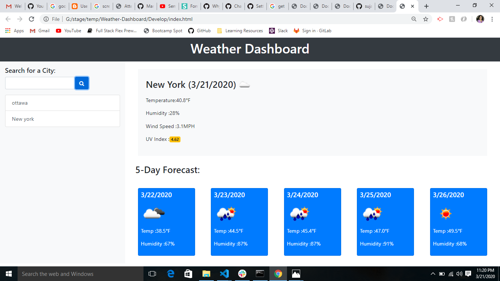
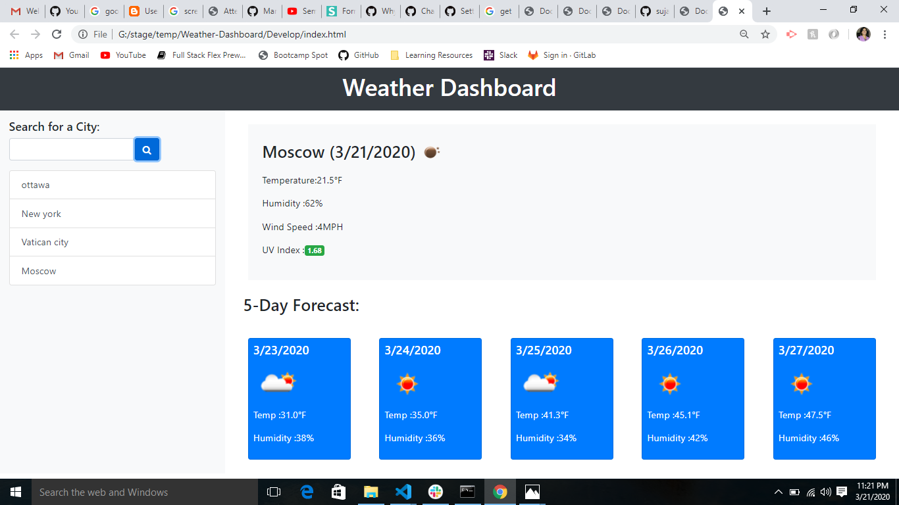
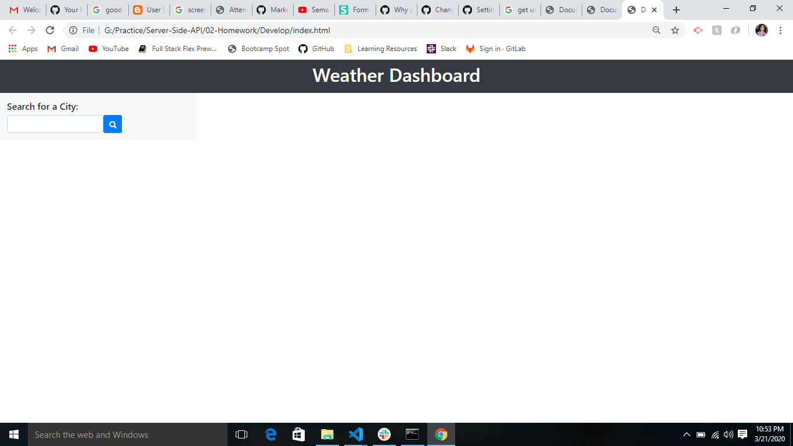

# Server-Side APIs: Weather Dashboard

## Overview 
An application that displays weather outlook for multiple cities by making calls to ThirdParty
OpenWeather API and processing the received data.

The application has been designed based on the following criteria:-

1. For each city searched by the user,current date's weather along with 5 day forecast is presented.
   The city is then added to a search history list maintained by this application.

2. The current weather conditions for a city are presented with the city name, the date, an icon
   representation of weather conditions, the temperature, the humidity, the wind speed, and the UV index.

3. The UV index is presented with a color that indicates whether the conditions are favorable,
   moderate, or severe

4. Future weather conditions for that city are presented with a 5-day forecast that displays the date,
   an icon representation of weather conditions, the temperature, and the humidity.

5. When the user click's on a city in the search history,the current and future conditions for that city
   are presented.

6. On (re)opening the weather dashboard,the user is presented with the last searched city forecast.

This app runs in the browser and features dynamically updated HTML and CSS powered by JavaScript code. 
It also features a clean,polished and responsive user interface, ensuring that it adapts to multiple
screen sizes.

## Functionality
When the user enters a cityname in the search input form and clicks on the search button,the backend
javascript function uses the cityname to make a request to openweather API to fetch the current weather
data consisting of temperature,humidity,windspeed and UVIndex.
It also makes a request to openWeather API to fetch the next 5 days weather forecast data consisting of
temperature and humidity.

Each city name is then added to a list of history items stored in localstorage.

Any invalid cityname entered by the user results in a 404 response from the openweather API which results
in exception being thrown on the console and no further processing occurs. 
In this case,the last city's info is still displayed.

If the user clicks on any city from the history list,that city's weather info is displayed by invoking the
onclick trigger function(setup during history item rendering).

On reloading the page,history info from local storage is retrieved and the last city (from the list)
weather info is displayed.

The following images demonstrate the application functionality:

